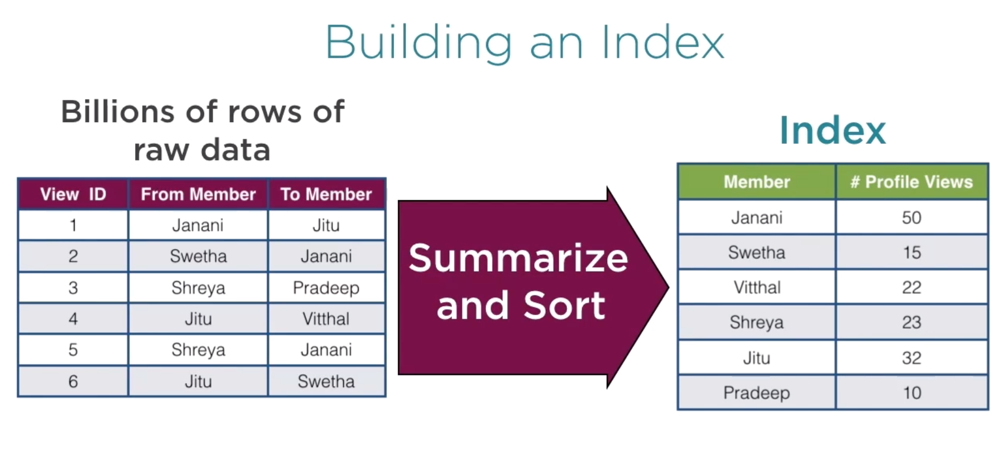
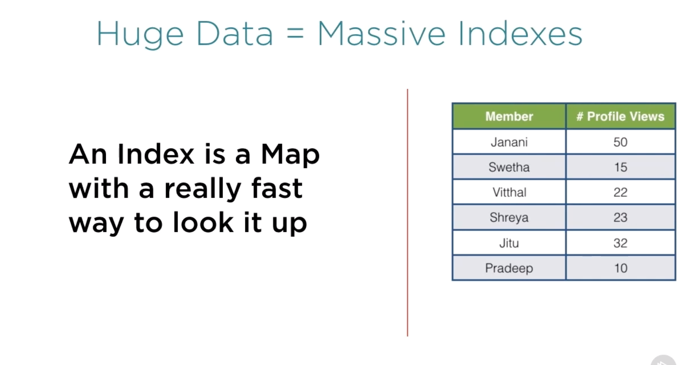
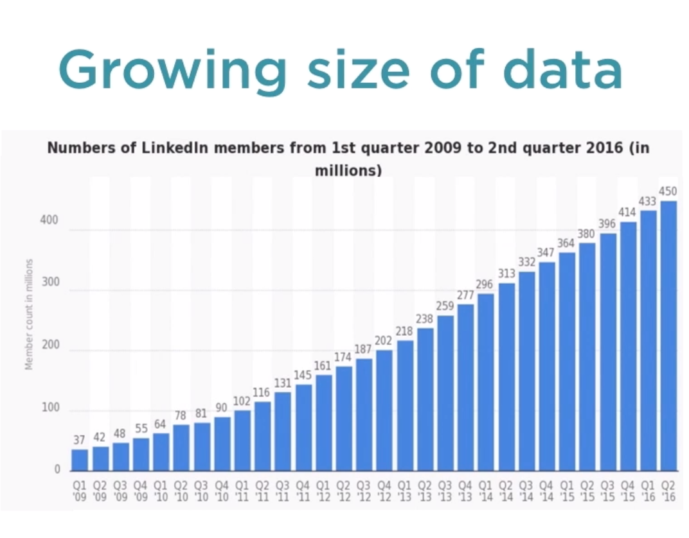
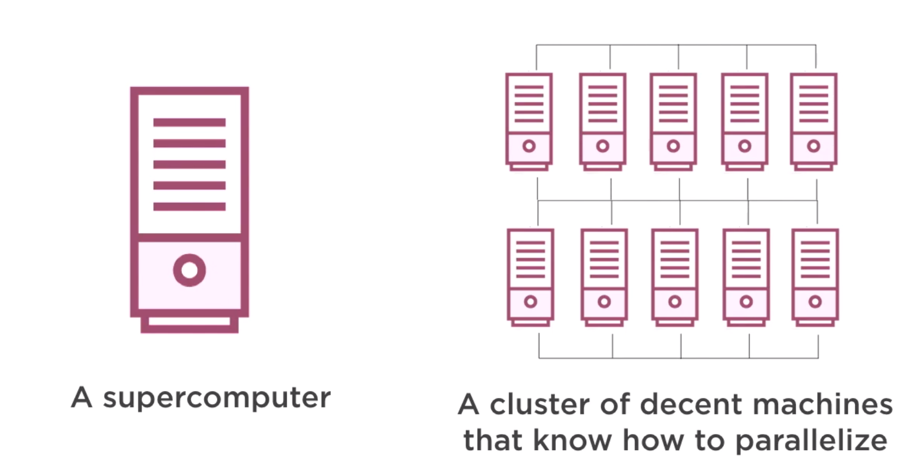
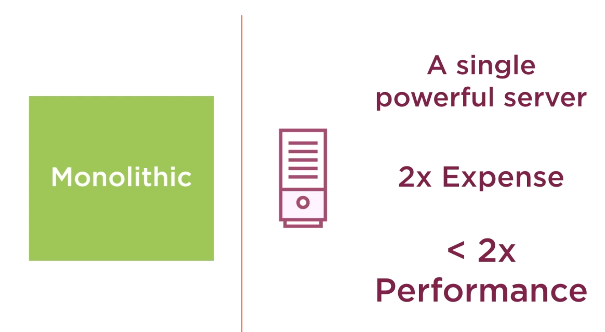
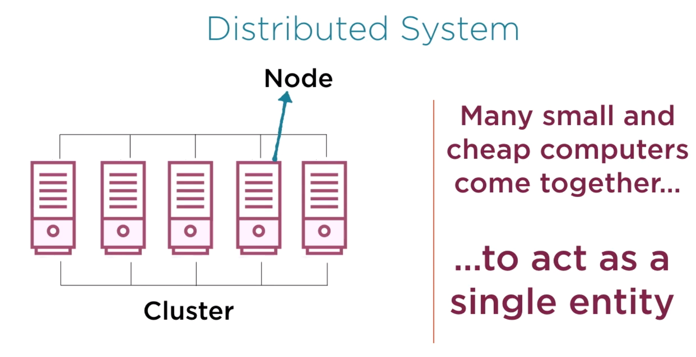
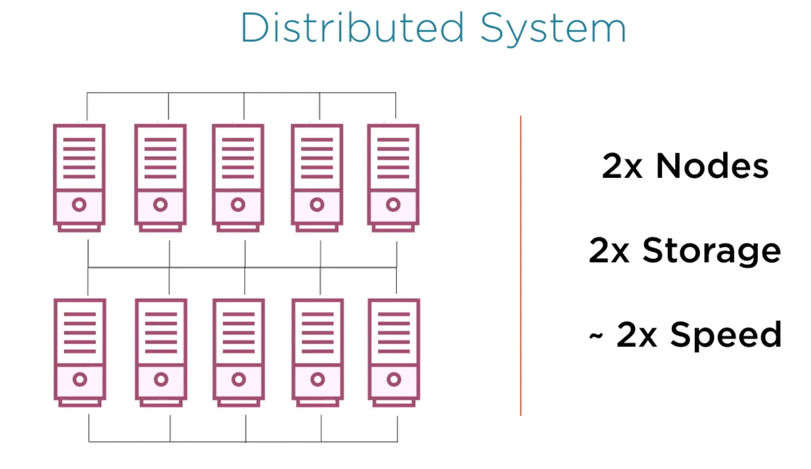

# map reduce
- Art of thinking parallel
- Need of distributed computing
# Usage
## Facebook
- Facebook user analytics
- More than billion users logon to Facebook, but it takes few milli seconds to answer, How many friends are common between two person A and B
## Google
- Internet has more than 40 billions of pages
- Still, Google can search result less than a second
## Linkedin
- Member analytics
- Has 450 millions users
- 7 people viewed your profile in the past 3 days
- 8% profile rank in the past 30 days
# Indexes
- These insights are extracted from huge data set, peta bytes in size
- These quick lookup possible is powered by indexes
- Index helped to quickly retrieved the information you are looking for
- How these indexes are build are challenge in itself

# System requirement
- Store 
- Process
- Growing size of data
Infrastructure has to support tomorrow. System needs to scale with data.
Architecture like `Hadoop` was developed, which can grow as your data grows.

# Ways to build system
- Monolithic
- Distributed

## Monolithic

## Distributed

# Complexities of distributed data
- partitioning
- Fault tolerance and recovery
- Parallel processing
- complexities of co-ordination
# Complexities of storage and processing
- Programmer just needs to specify what processing needs to be performed in parallel.
- MapReduce take care of task
# Thinking Parallel with MapReduce
- Abstraction
    - map
    - reduce
- 